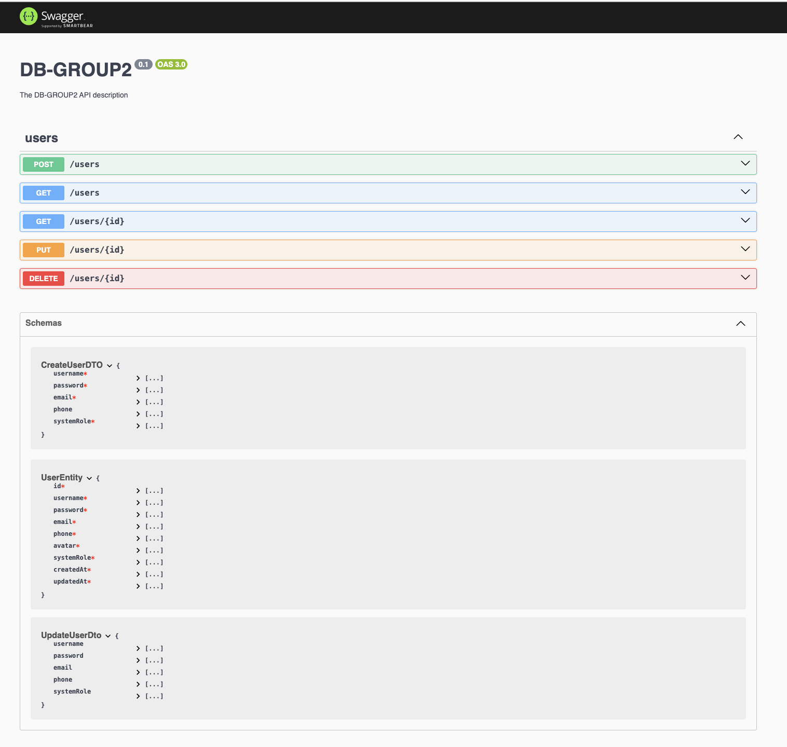
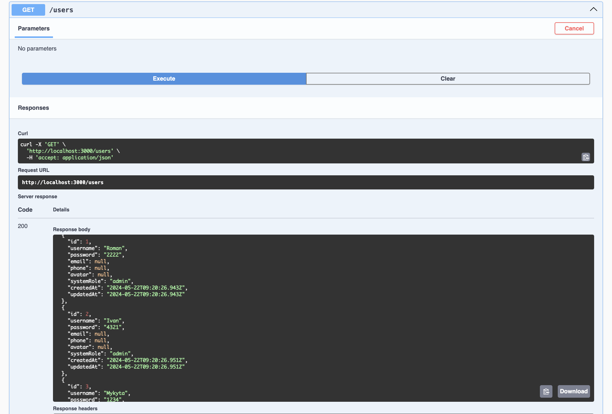
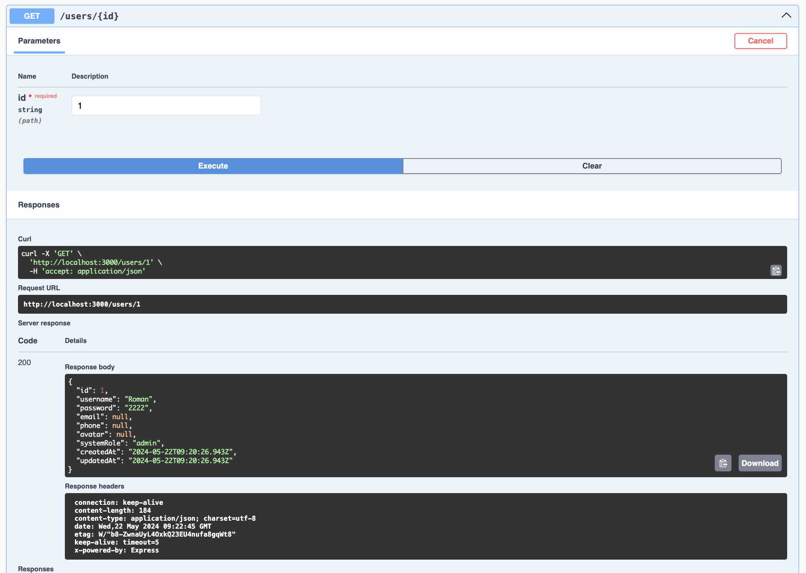
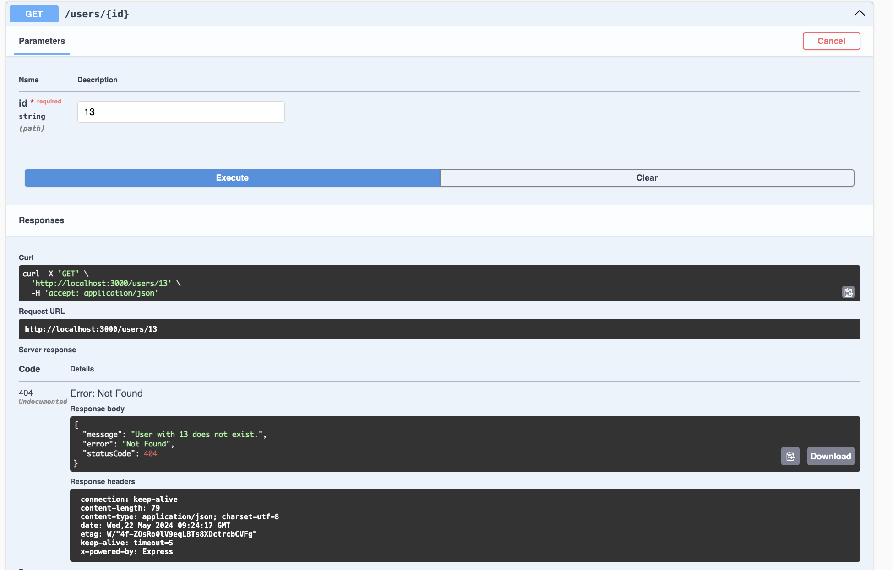
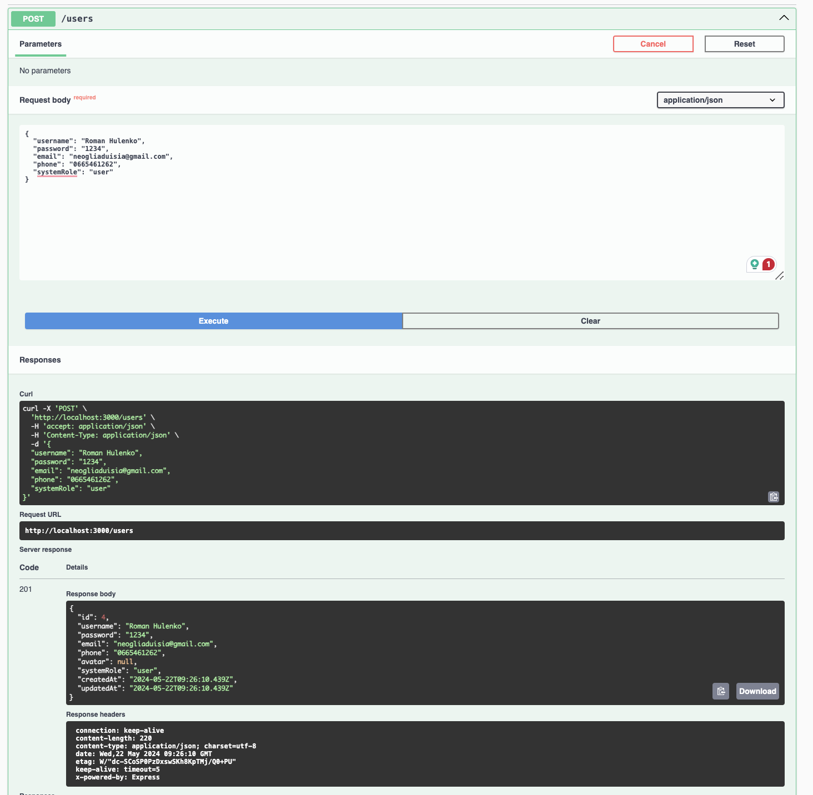
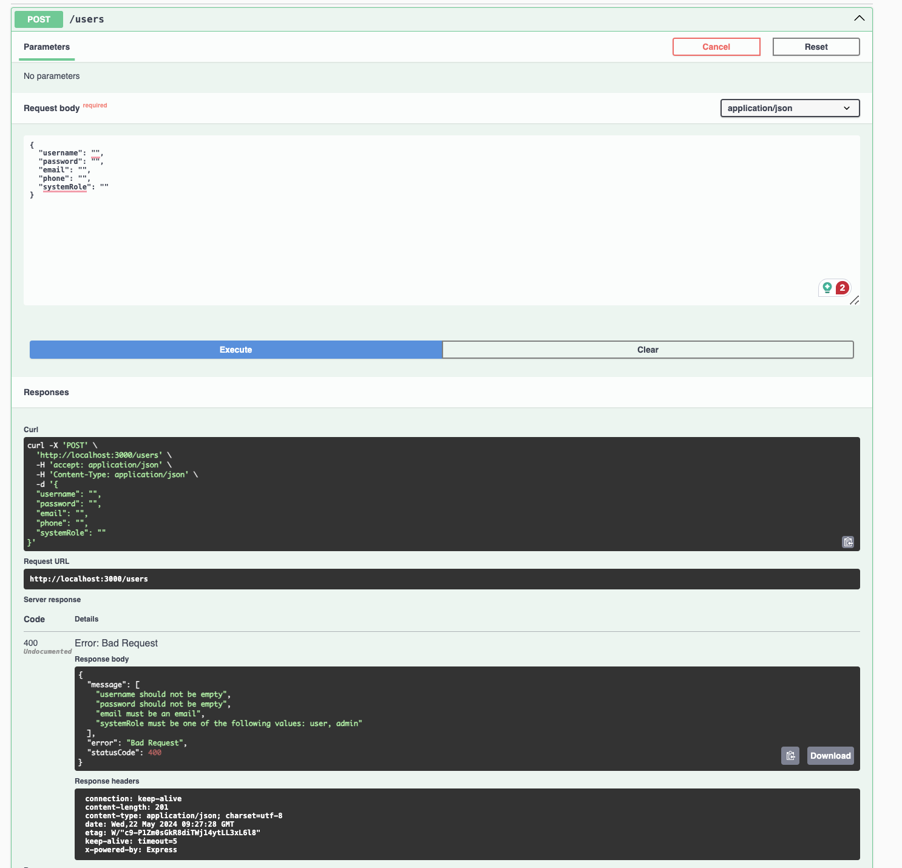
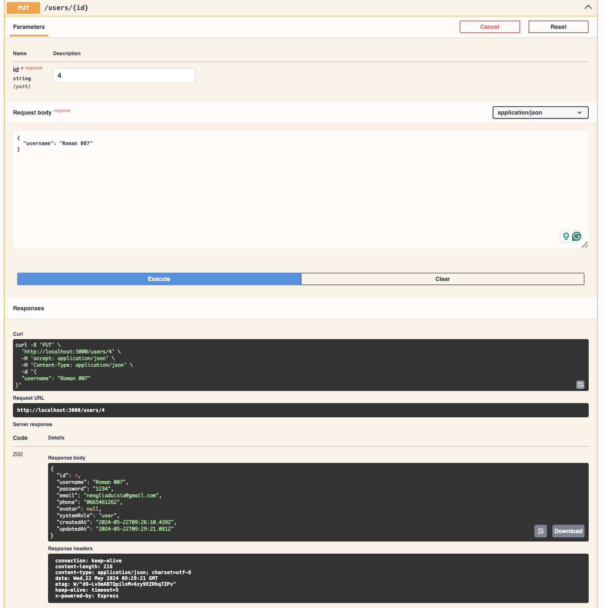
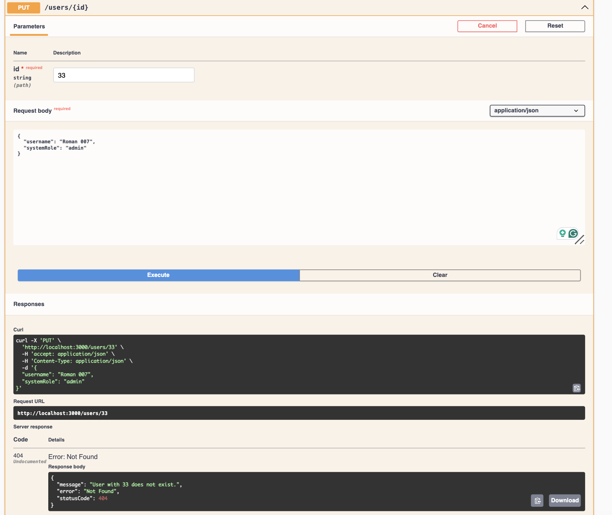
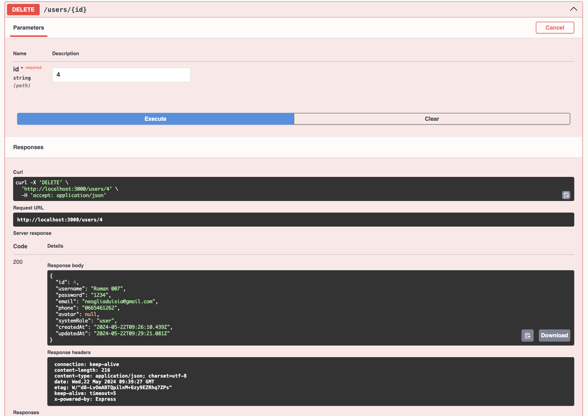
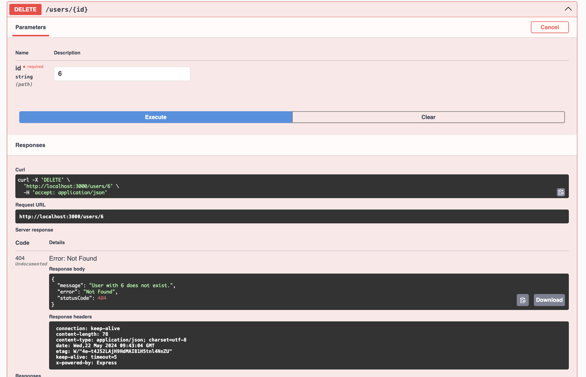

# Тестування працездатності системи

Тестування сервісу за допомогою [Swagger](https://swagger.io/).

## Cтруктура Swagger

## Отримання користувача (GET)

### Успішне отримання списку всіх користувачів

### Успішне отримання даних одного користувача

### Спроба отримати дані неіснуючого користувача

## Створення користувача (POST)

### Успішне створення користувача

### Спроба створити користувача з неповними даними

## Оновлення користувача (PUT)

### Успішне оновлення інформації про користувача

### Спроба оновити дані неіснуючого користувача

## Видалення користувача (DELETE)

### Успішне видалення користувача з системи

### Спроба видалити неіснуючого користувача

